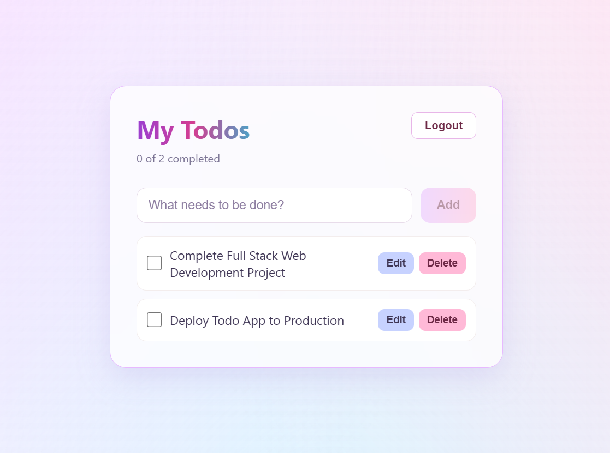
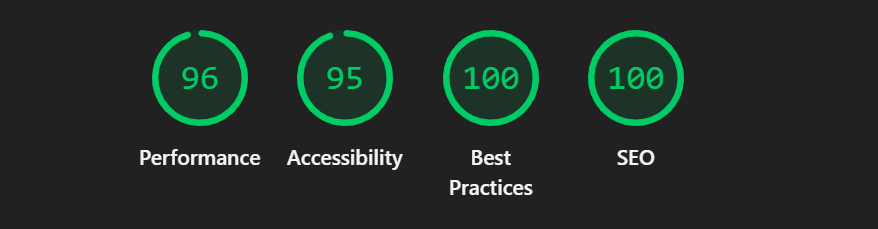

# TaskFlow - Full Stack Todo App

TaskFlow is a full-stack Todo application built with React, Node.js, Express.js, and MongoDB. It includes user authentication, global state management with React Context, protected Todo routes, and complete Todo management functionality with a polished, responsive UI.

## Live Demo

- **Frontend:** https://fullstack-todo-app-gold-iota.vercel.app
- **Backend API:** https://fullstack-todo-app-production-1d45.up.railway.app

## Screenshots



### Lighthouse Audit — Before & After

SEO improved from 82 to 100 after adding a meta description and a valid `robots.txt`.

| Before | After |
|---|---|
|  |  |

## Features

- User Signup
- User Login
- JWT-based Authentication
- Secure Logout
- Global state management using React Context API (Auth + Todos)
- Protected Todo routes
- Create new Todos
- Edit Todos
- Mark Todos as completed or incomplete
- Delete Todos
- User-specific Todos
- MongoDB database integration
- Skeleton loading UI for all data-fetching states
- Polished empty states (no blank screens)
- Error states with a "Try Again" retry option
- Responsive user interface
- Modern glassmorphism-inspired design with an animated aurora background

## Tech Stack

### Frontend

- React
- React Context API (global state)
- React Router
- JavaScript
- HTML
- CSS
- Vite

### Backend

- Node.js
- Express.js
- MongoDB
- Mongoose
- JWT
- bcrypt

## Global State Management

TaskFlow uses React's built-in Context API instead of an external state library like Redux, since the app's shared state (auth session and todo data) is simple enough that Context keeps things lightweight and beginner-friendly.

Two contexts are used:

- **AuthContext** — holds the logged-in user, token, and `isAuthenticated` status, and exposes `login()` and `logout()`. This replaced direct `localStorage` reads scattered across components and removed the need for hard page reloads after login/signup.
- **TodoContext** — holds `todos`, `loading`, and `error` state along with `addTodo`, `toggleTodo`, `editTodo`, and `deleteTodoItem`. This removed prop-drilling that previously passed todo data and handler functions from `Home` through `TodoList` down to `TodoItem`.

Components now consume state directly via `useAuth()` and `useTodos()` hooks instead of receiving it through props.

## Project Structure

```text
fullstack-todo-app/
│
├── screenshots/
│   ├── todo-app-ui.png
│   ├── lighthouse-scores-before.png
│   └── lighthouse-scores-After.png
│
├── frontend/
│   ├── public/
│   │   └── robots.txt
│   ├── src/
│   │   ├── api/
│   │   │   ├── authApi.js
│   │   │   └── todoApi.js
│   │   │
│   │   ├── context/
│   │   │   ├── AuthContext.jsx
│   │   │   └── TodoContext.jsx
│   │   │
│   │   ├── components/
│   │   │   ├── ErrorMessage.jsx
│   │   │   ├── Loader.jsx
│   │   │   ├── ProtectedRoute.jsx
│   │   │   ├── TodoForm.jsx
│   │   │   ├── TodoItem.jsx
│   │   │   ├── TodoList.jsx
│   │   │   └── TodoSkeleton.jsx
│   │   │
│   │   ├── pages/
│   │   │   ├── Home.jsx
│   │   │   ├── Login.jsx
│   │   │   └── Signup.jsx
│   │   │
│   │   ├── styles/
│   │   │   └── App.css
│   │   │
│   │   ├── App.jsx
│   │   └── main.jsx
│   │
│   ├── index.html
│   ├── vercel.json
│   ├── .env.example
│   ├── .gitignore
│   └── package.json
│
└── backend/
    ├── config/
    │   └── db.js
    │
    ├── controllers/
    │   ├── authController.js
    │   └── todoController.js
    │
    ├── middleware/
    │   └── authMiddleware.js
    │
    ├── models/
    │   ├── User.js
    │   └── Todo.js
    │
    ├── routes/
    │   ├── authRoutes.js
    │   └── todoRoutes.js
    │
    ├── .env
    ├── .env.example
    ├── .gitignore
    ├── server.js
    └── package.json
```

## Authentication

TaskFlow uses JWT authentication to protect user accounts and Todo data.

Users first create an account using the Signup page. After registration, they can log in using their email and password.

After successful login, the server provides an authentication token. This token, along with the user's info, is stored via `AuthContext`, which keeps `localStorage` in sync and makes the session available anywhere in the app through the `useAuth()` hook — without needing a full page reload.

Only authenticated users can access the Todo functionality; `ProtectedRoute` checks `isAuthenticated` from `AuthContext` and redirects unauthenticated users to `/login`.

## Todo Management

After logging in, users can:

1. Add a new Todo.
2. Mark a Todo as completed.
3. Edit an existing Todo.
4. Delete a Todo.
5. View their own Todos.
6. Logout from the application.

Each user's Todos are associated with their account, so users cannot access another user's Todo data.

## Loading, Empty & Error States

- **Loading:** While todos are being fetched, animated skeleton placeholders are shown instead of a blank screen or a plain spinner.
- **Empty:** When a user has zero todos, a polished empty state is shown ("No tasks yet — Add your first task above to get started") with a button that focuses the add-todo input.
- **Error:** If a request fails, an error message is shown along with a "Try Again" button that re-fetches the todos.

## API Endpoints

### Authentication

| Method | Endpoint | Description |
|--------|----------|-------------|
| POST | `/api/auth/signup` | Create a new user account |
| POST | `/api/auth/login` | Login to an existing account |

### Todos

| Method | Endpoint | Description |
|--------|----------|-------------|
| GET | `/api/todos` | Get the logged-in user's Todos |
| POST | `/api/todos` | Create a new Todo |
| PUT | `/api/todos/:id` | Update a Todo |
| DELETE | `/api/todos/:id` | Delete a Todo |

Todo endpoints require a valid JWT token.

## Database

MongoDB is used to permanently store users and Todo data.

Mongoose is used to define database models and communicate with MongoDB.

The backend connects to MongoDB using a connection string stored in an environment variable.

> ## ⚠️ IMPORTANT: MongoDB Connection Troubleshooting

**If the backend shows a MongoDB connection error (`MongoServerSelectionError` or similar), this is NOT a code issue.**

MongoDB Atlas only allows connections from **whitelisted IP addresses** (under Network Access). Many ISPs — especially in Pakistan — assign **dynamic IP addresses**, meaning your IP changes periodically (after router restarts, network switches, etc.). When your IP changes, MongoDB Atlas blocks the connection because the new IP isn't whitelisted yet.

### ✅ How to fix it:

1. Go to [MongoDB Atlas](https://cloud.mongodb.com) → your project
2. Click **Network Access** in the left sidebar
3. Click **"Add IP Address"**
4. Select **"Allow Access from Anywhere"** (adds `0.0.0.0/0`)
5. Confirm — this permanently resolves the issue for development

**This is a well-known infrastructure limitation of dynamic IP networks and MongoDB Atlas's security model — it is not a bug in the application code.** The backend code, Mongoose connection logic, and error handling are implemented correctly; the connection simply requires the current network IP to be authorized in Atlas.

For production deployments, IP whitelisting is handled differently (e.g. via a fixed server IP or VPC peering), but for local development, "Allow Access from Anywhere" is the standard practice.

---

## Environment Variables

### Backend (`backend/.env`)

```env
MONGODB_URI=your_mongodb_connection_string
JWT_SECRET=your_jwt_secret
PORT=5000
FRONTEND_URL=http://localhost:5173
```

`FRONTEND_URL` is used to configure CORS — in production it must be set to the deployed frontend's URL so the browser is allowed to call the API.

### Frontend (`frontend/.env`)

```env
VITE_API_URL=http://localhost:5000
```

In production (Vercel), this is set to the deployed backend URL instead.

The actual `.env` files should never be uploaded to GitHub — both are already excluded via `.gitignore`. Reference `.env.example` files are included in both `backend/` and `frontend/` instead.

## Running the Project Locally

### Backend

Open a terminal and navigate to the backend folder:

```bash
cd backend
```

Install dependencies:

```bash
npm install
```

Create a `.env` file and add the required environment variables.

Start the backend:

```bash
npm start
```

The backend runs on:

```text
http://localhost:5000
```

### Frontend

Open another terminal and navigate to the frontend folder:

```bash
cd frontend
```

Install dependencies:

```bash
npm install
```

Start the frontend:

```bash
npm run dev
```

Then open the local URL provided by Vite in the browser.

## Deployment

The app is deployed across three services:

| Layer | Platform | Notes |
|---|---|---|
| Frontend | [Vercel](https://vercel.com) | Deployed from `frontend/` (Root Directory), auto-deploys on push to `main` |
| Backend | [Railway](https://railway.app) | Deployed from `backend/` (Root Directory), auto-deploys on push to `main` |
| Database | [MongoDB Atlas](https://cloud.mongodb.com) | Network Access set to allow all IPs (`0.0.0.0/0`) since the backend host's outbound IP is not fixed |

**Deployment notes:**
- The frontend includes a `vercel.json` rewrite rule so client-side routes (e.g. `/login`, `/signup`) don't 404 on a hard refresh or direct URL visit — this is required for any React Router SPA on Vercel.
- The backend's CORS configuration only allows requests from `http://localhost:5173` and the URL in `FRONTEND_URL`, rather than allowing all origins.
- If the backend is redeployed/restarted and MongoDB connection errors appear, check that MongoDB Atlas → Network Access still has an active `0.0.0.0/0` entry.

### Lighthouse Audit

Run against the deployed frontend (mobile, Chrome DevTools):

| Category | Score |
|---|---|
| Performance | 96 |
| Accessibility | 95 |
| Best Practices | 100 |
| SEO | 100 |

SEO was improved from 82 → 100 by adding a meta description (`frontend/index.html`) and a `robots.txt` (`frontend/public/robots.txt`), which resolved Lighthouse's "missing meta description" and "robots.txt is not valid" flags.

## Security

- Passwords are hashed before being stored in the database.
- JWT tokens are used for authentication.
- Protected routes require authentication.
- MongoDB credentials and JWT secrets are stored in environment variables.
- `.env` is excluded from Git tracking.

## Future Improvements

Possible future improvements include:

- Todo search and filtering
- Todo categories
- Due dates and reminders
- User profile
- Dark mode
- Improved dashboard and statistics

## Author

**Arooj Mehmood**

BS Computer Science Student

## License

This project was created for learning and development purposes.